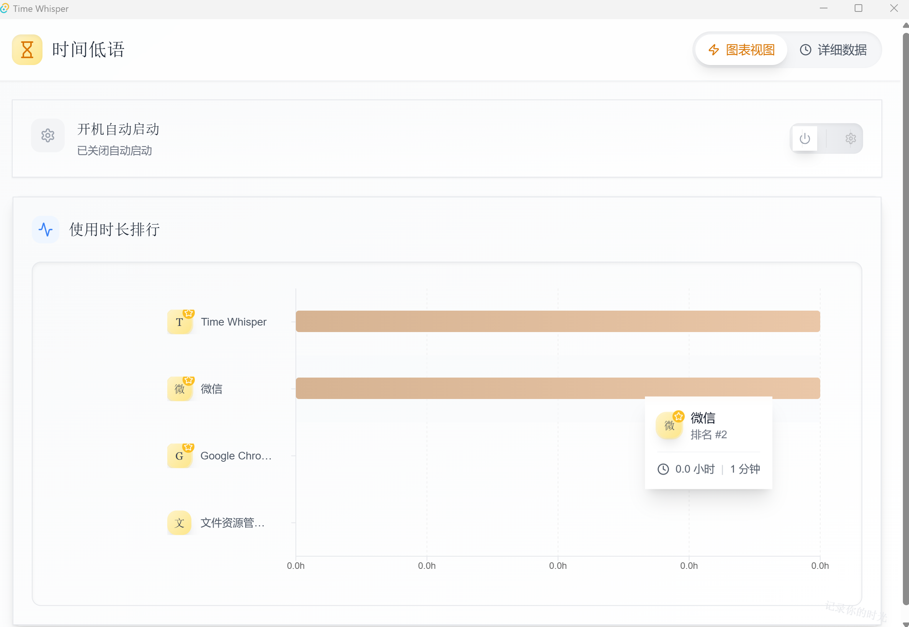
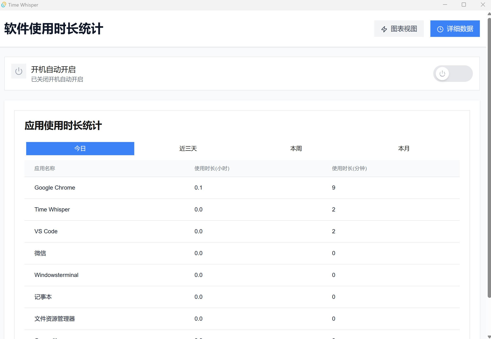
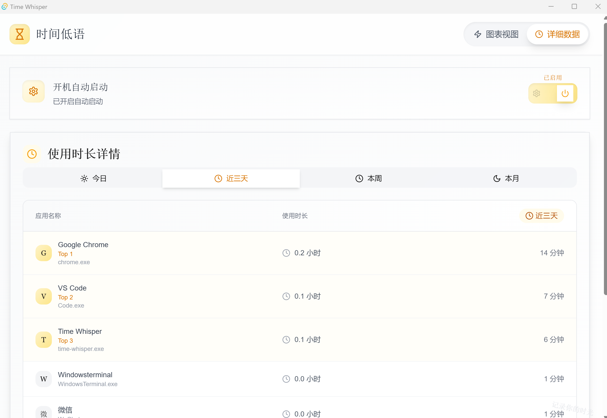

# TimeWhisper

[](https://skillicons.dev)

An elegant application usage time tracking tool.

TimeWhisper helps you understand your application usage habits by providing clear data visualization of your software usage time, supporting statistical analysis across multiple time dimensions.

## ✨ Features

- 🕒 Real-time application usage monitoring
- 📊 Multi-dimensional statistics (Daily/3-Day/Weekly/Monthly)
- 💾 Local data persistence
- 🚀 Lightweight and high-performance
- 🖥️ Elegant user interface
- 🔄 Auto-start support

## 🖥️ Screenshots





## 🚀 Development

### Prerequisites

- [Node.js](https://nodejs.org/) (>= 16)
- [Rust](https://www.rust-lang.org/) (>= 1.70)
- [VS Build Tools](https://visualstudio.microsoft.com/visual-cpp-build-tools/) (Windows)

### Setting Up Development Environment

```bash
# Clone the repository
git clone https://github.com/Erio-Harrison/time-whisper.git
cd time-whisper

# Install dependencies
npm install

# Start development server
cargo tauri dev
```

### Building

```bash
# Build production version
cargo tauri build
```

## 🛠️ Tech Stack

- **Frontend**
  - Next.js
  - React
  - TypeScript
  - Tailwind CSS
  - shadcn/ui
  - Recharts

- **Backend**
  - Rust
  - Tauri
  - SQLite

## 📝 Implemented Features

- [x] Real-time application monitoring
- [x] Multi-dimensional time statistics
- [x] Data persistence
- [x] Auto-start management
- [x] Chart/Table data visualization
- [ ] Data export functionality
- [ ] Multi-language support
- [ ] Cloud synchronization
- [ ] More platform support

## 🤝 Contributing

Contributions are welcome! Please read our [Contributing Guidelines](CONTRIBUTING.md) for details.

## 📄 License

This project is licensed under the MIT License - see the [LICENSE](LICENSE) file for details.

## 📧 Contact

For issues or suggestions:
- Create an [Issue](https://github.com/yourusername/time-whisper/issues)

---

<p align="center">Made with ❤️ by [Harrison]</p>

## 🏗️ Project Structure

```
project-root/
├── src-tauri/                     # Rust backend
│   ├── src/
│   │   ├── main.rs               # Main entry and Tauri commands
│   │   ├── platform/             # Cross-platform implementation
│   │   │   ├── mod.rs           # Platform abstraction layer
│   │   │   └── windows.rs        # Windows implementation
│   │   └── db/                   # Data management
│   │       ├── mod.rs           # Module exports
│   │       ├── storage.rs        # SQLite storage
│   │       └── types.rs          # Data types
│   └── Cargo.toml                # Rust dependencies
│
├── src/                          # Frontend code
│   ├── app/                      # Next.js pages
│   │   ├── page.tsx             # Main page
│   │   └── layout.tsx           # App layout
│   │
│   ├── components/              # React components
│   │   └── dashboard/
│   │       ├── UsageChart.tsx   # Chart view
│   │       ├── UsageTable.tsx   # Detailed data view
│   │       └── AutoStart.tsx    # Auto-start settings
│   │
│   └── lib/                     # Utilities and types
│       ├── processName.ts       # Process name handling
│       └── types.ts             # TypeScript types
│
├── package.json                 # Frontend dependencies
└── tailwind.config.js          # Tailwind configuration
```

## ⚡ Core Modules

### Backend (Rust)
- Window activity monitoring
- Data persistence layer
- Auto-start management
- Real-time data updates

### Frontend (React)
- Real-time data visualization
- Multi-dimensional statistics
- Interactive data tables
- System settings management

Need any clarification or additional details?